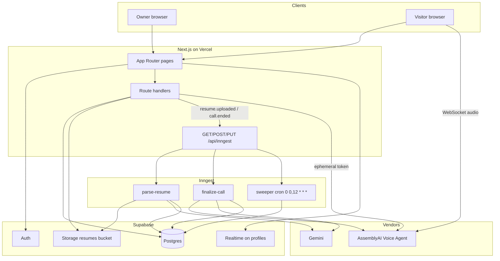
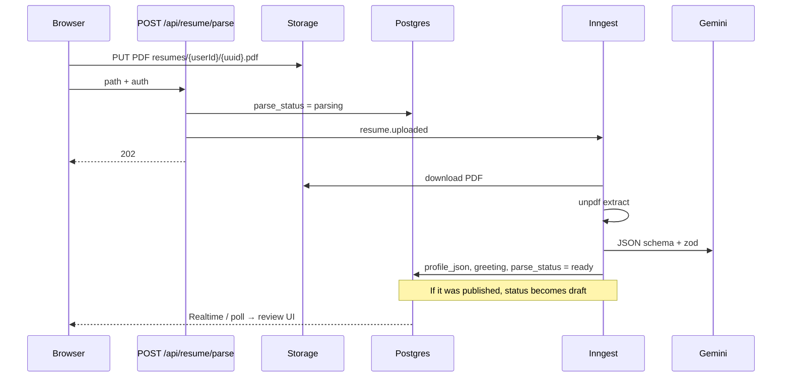
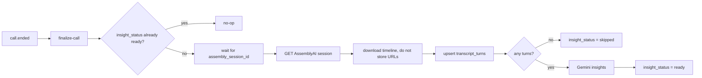
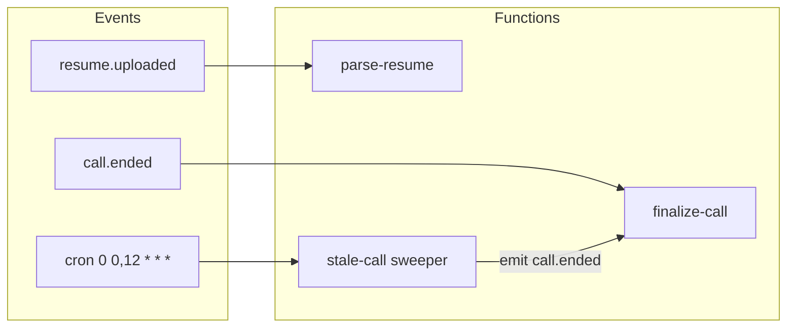
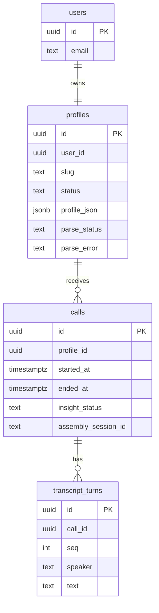

# Profili

Turn a resume into a public voice agent. Recruiters and visitors talk to the published profile; you keep the transcript and a short insight report.

**Live site:** [profili.fyi](https://profili.fyi)

```text
PDF  →  Gemini profile  →  share /p/{slug}  →  AssemblyAI call  →  insights
              ▲                                         ▲
         Inngest parse                             Inngest finalize
```

## What it does

1. Sign in with email or Google (Supabase Auth).
2. Upload a resume PDF. Parsing runs in the background so the upload request stays fast.
3. Review the extracted profile, pick a voice, publish a slug.
4. Share `https://profili.fyi/p/{slug}` or embed the same page.
5. Visitors start a short live call. The agent answers from the published `profile_json`, not a fresh LLM pass per question.
6. After hangup, AssemblyAI’s session timeline is the source of truth. Gemini writes insights for the owner dashboard.

Parse never unpublishes a live page while the job is running. If a published profile is re-parsed, it returns to draft so you can re-publish.

## Stack

| Layer | Choice |
| --- | --- |
| App | Next.js 16 App Router, React 19, Tailwind v4 |
| Auth | Supabase Auth cookie session (`@supabase/ssr`) |
| Data | Postgres via Drizzle, Supabase pooler on `:6543` |
| Files | Private Storage bucket `resumes` |
| Jobs | Inngest (`/api/inngest`) |
| Parse + insights | Gemini (`gemini-3.8-flash` → `3.7-flash` → `3.1-flash-lite`) |
| Voice | AssemblyAI Voice Agent (ephemeral token, browser WebSocket) |

The Next.js app is a monolith. Slow work (PDF extract, Gemini, AssemblyAI timeline fetch) lives in Inngest functions, not in the upload or hangup HTTP handlers.

## Local development

You need **two processes**: Next on `:3000` and the Inngest Dev Server on `:8288`.

```bash
pnpm install
cp .env.example .env.local
# fill keys, then:
pnpm db:migrate
pnpm dev
pnpm inngest:dev
```

`pnpm inngest:dev` syncs `http://localhost:3000/api/inngest`. In `.env.local` set `INNGEST_DEV=1` and **do not** set cloud event or signing keys while using the Dev Server.

Open [http://localhost:3000](http://localhost:3000). Inngest UI: [http://localhost:8288](http://localhost:8288).

### Environment

See `.env.example`. You will need:

- `NEXT_PUBLIC_SUPABASE_URL` / `NEXT_PUBLIC_SUPABASE_ANON_KEY`
- `DATABASE_URL` (transaction pooler; Drizzle uses `prepare: false`)
- `SUPABASE_SERVICE_ROLE_KEY` (server only; parse job downloads the PDF)
- `GEMINI_API_KEY`
- `ASSEMBLYAI_API_KEY`
- `NEXT_PUBLIC_SITE_URL` (`http://localhost:3000` locally)

Never commit `.env.local`. Never ship the service role key to the browser.

## App map

| Path | Who | Role |
| --- | --- | --- |
| `/` | Public | Landing |
| `/signup` `/login` | Public | Auth |
| `/app` | Owner | Agent + publish |
| `/app/create` | Owner | Upload resume |
| `/app/review` | Owner | Edit extracted profile |
| `/app/dashboard` | Owner | Calls and insights |
| `/p/{slug}` | Public | Talk to the published agent |
| `/api/inngest` | Inngest | Serve functions (GET / POST / PUT) |

## Scripts

```bash
pnpm dev              # Next on :3000
pnpm inngest:dev      # Inngest Dev Server → /api/inngest
pnpm build
pnpm db:generate      # Drizzle from schema
pnpm db:migrate
pnpm db:studio
```

## Deploy notes

Vercel hosts the Next app. Inngest Cloud runs the jobs against `https://<your-domain>/api/inngest`.

- Do **not** set `INNGEST_DEV` on Vercel.
- Production needs `INNGEST_EVENT_KEY` and `INNGEST_SIGNING_KEY` once the Inngest app exists. Without them, parse and insights stay queued.
- Keep `SUPABASE_SERVICE_ROLE_KEY` on the server. The parse job cannot download Storage without it.

---

## Architecture

Sync paths stay short: auth, upload ack, mint a voice token, read the dashboard. Async paths retry: parse resume, finalize call, stale-call sweeper.

### System



### Parse (owner)

Upload returns **202**. The UI watches `profiles.parse_status` over Realtime plus a 2s poll.



Retries and Gemini concurrency are on the Inngest function. Exhausted retries set `parse_status=failed` and a short `parse_error`. Retry in the UI re-emits the same `resume_path`.

### Live call (visitor)

Voice context is the **published** `profile_json`. Gemini is not on the hot path.

```mermaid
sequenceDiagram
  participant Visitor
  participant Page as GET /p/{slug}
  participant Token as POST /api/voice/token
  participant AAI as AssemblyAI
  participant Session as POST /api/voice/session
  participant End as POST /api/voice/end
  participant Inngest

  Visitor->>Page: published profile
  Visitor->>Token: name, purpose, email
  Token->>Token: atomic hourly rate bucket
  Token->>Token: insert calls row
  Token->>AAI: mint token (35s, fallback 60s)
  Token-->>Visitor: token + call id
  Visitor->>AAI: WebSocket + session.update
  AAI-->>Visitor: session.ready
  Visitor->>Session: assembly_session_id
  Note over Visitor: Live STT POST /transcript is UX only
  Visitor->>End: hangup or sendBeacon on pagehide
  End->>End: ended_at, insight_status = pending
  End->>Inngest: call.ended once
```

A cron twice a day (00:00 and 12:00 UTC) ends calls with no `ended_at` and `started_at` older than 90s, then emits the same `call.ended` event.

### After the call



The dashboard `GET /api/voice/calls` is read-only. Pending or processing shows **Processing**. Failed or skipped can **Retry insights**, which re-emits `call.ended`.

### Events and jobs



| Job | Trigger | Writes |
| --- | --- | --- |
| `parse-resume` | `resume.uploaded` | `profile_json`, `parse_status` |
| `finalize-call` | `call.ended` | `transcript_turns`, insights |
| Sweeper | cron twice a day (00:00 and 12:00 UTC) | `ended_at` on abandoned calls, then `call.ended` |

### Data



Identity is `auth.users`. `public.users` and `profiles` follow that id. RLS covers owner data; public talk pages load published profiles through the server with Drizzle, not the visitor’s anon RLS.

---

More pipeline detail: [`docs/03-current-pipeline.txt`](docs/03-current-pipeline.txt).
