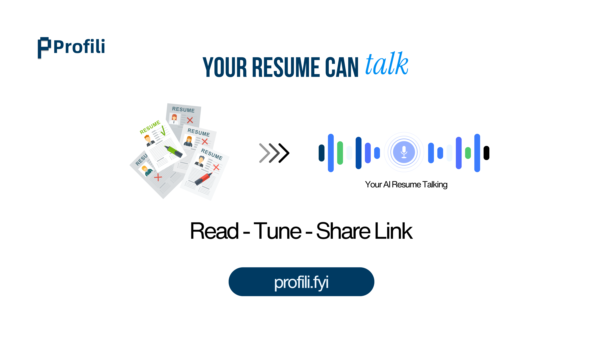

<p align="center">
  
</p>

<p align="center">
  <strong>Profili</strong> · Your résumé, as a voice you can share<br />
  Built by <strong>TeamRennes</strong> · Live at <a href="https://profili.fyi">profili.fyi</a>
</p>

<p align="center">
  <a href="https://profili.fyi">Product</a>
  ·
  <a href="https://profili.fyi/presentation">Pitch deck</a>
  ·
  <a href="https://www.linkedin.com/company/profili-fyi/">LinkedIn</a>
</p>

---

## What is Profili?

Profili turns a PDF résumé into a **public voice agent**. Someone opens your link (or an embed on your site), talks out loud, and gets answers grounded in *your* experience, not a generic chatbot.

It is for professionals who are tired of being skimmed. It is not a recruiting marketplace. You own the voice, the slug, and the transcript.

**The problem we started from:** one of us sent about 100 résumés and heard almost nothing back. A PDF is easy to ignore. It cannot explain a stack choice, a tradeoff, or a project. When we shared a voice instead, people asked questions. Ghosting became a conversation.

## What you can do

1. **Sign in** with email or Google.
2. **Upload a PDF.** Parsing runs in the background (Inngest + Gemini), so the UI stays fast.
3. **Review** the structured profile, pick a voice, publish a slug.
4. **Share** `/participant/{slug}` or drop one embed snippet on a portfolio.
5. **See who talked.** After a call, the owner gets a transcript plus a short insight report (intent, query, grounded / tone / fit).
6. **Leave a message** if a visitor would rather write than talk. The owner can get an email.

Live voice context is always the **published** profile. Slow work (parse, timeline, insights) is off the request path.

## Why it is different

| | |
| --- | --- |
| Grounded | If it is not on the résumé, it is not said. |
| Interruptible | Visitors can talk over the agent. It stops, like a real conversation. |
| Visible | Who called, what they asked, how the answer scored. |
| Yours | A link and an embed you control. Not a feed of other people's CVs. |

## How it works

```text
PDF upload  →  Inngest parse-resume  →  Gemini JSON profile  →  publish
visitor talks  →  AssemblyAI Voice Agent  →  hangup / timeout
            →  Inngest finalize-call  →  Assembly timeline + Gemini insights
```

Paper becomes a voice in three moves: **Read** (structure the PDF), **Tune** (voice + slug), **Link** (share or embed).

Public talk length is 5 minutes. Abandoned sessions close with a per-call Inngest sleep, not a polling cron.

## Tech stack

| Technology | Role |
| --- | --- |
| [Next.js](https://nextjs.org/) 16 (App Router) | App, APIs, public pages, embed script |
| [React](https://react.dev/) 19 | UI |
| [TypeScript](https://www.typescriptlang.org/) | Types across app and jobs |
| [Tailwind CSS](https://tailwindcss.com/) v4 | Styling |
| [Framer Motion](https://www.framer.com/motion/) | Landing motion |
| [GSAP](https://gsap.com/) / [OGL](https://github.com/oframe/ogl) | Visuals |
| [Vercel](https://vercel.com/) | Hosting |
| [Supabase](https://supabase.com/) | Auth (cookie sessions), Postgres, private Storage for PDFs |
| [Drizzle ORM](https://orm.drizzle.team/) | Schema and queries |
| [Inngest](https://www.inngest.com/) | Background jobs: parse, call close, insights, owner email |
| [Google Gemini](https://ai.google.dev/) | Résumé JSON extract and post-call insights |
| [AssemblyAI](https://www.assemblyai.com/) Voice Agent | Live speech, barge-in, session timeline |
| [unpdf](https://github.com/unjs/unpdf) | PDF text extract before Gemini |
| [Zod](https://zod.dev/) | Request and LLM output validation |
| [Resend](https://resend.com/) | Optional owner message emails |
| [pnpm](https://pnpm.io/) | Package manager |

Service role and API keys stay on the server. The browser never sees the Supabase service role or playground AssemblyAI keys.

## Product surfaces

| Path | What it is |
| --- | --- |
| `/` | Landing |
| `/signup` `/login` | Auth |
| `/app` | Upload, review, publish |
| `/app/dashboard` | Calls, transcripts, insights |
| `/participant/{slug}` | Public voice page |
| `/presentation` | 10-slide hackathon pitch (landscape) |

Pricing (private beta is free; these are launch prices): **Free**, **Pro** ($9/mo), **Job-search pass** ($19 once). Visitors never pay to talk.

## Run locally

You need Next on `:3000` and the Inngest Dev Server on `:8288`.

```bash
pnpm install
cp .env.example .env.local
pnpm db:migrate
pnpm dev
pnpm inngest:dev
```

Fill `.env.local` from `.env.example`: Supabase, `DATABASE_URL`, `GEMINI_API_KEY`, `ASSEMBLYAI_API_KEY`, `NEXT_PUBLIC_SITE_URL`. Keep `SUPABASE_SERVICE_ROLE_KEY` on the server only. Production also needs `INNGEST_EVENT_KEY` and `INNGEST_SIGNING_KEY`.

## Team

**TeamRennes** · Profili · [profili.fyi](https://profili.fyi) · [hello@profili.fyi](mailto:hello@profili.fyi)

## License

Private. Built for hackathon submission and the live demo at [profili.fyi](https://profili.fyi).
